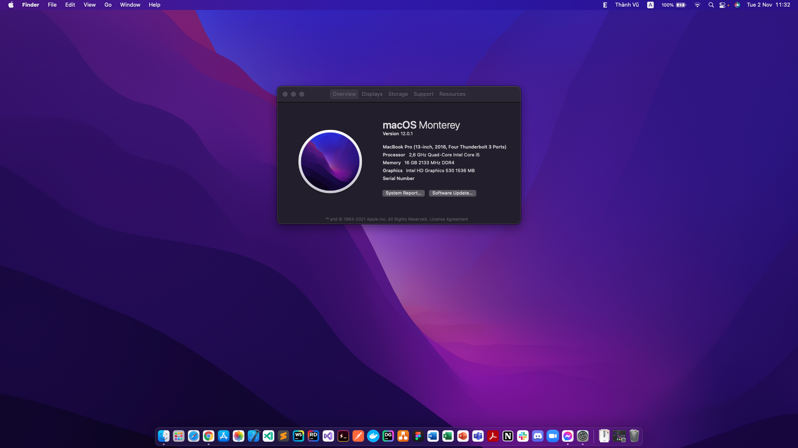
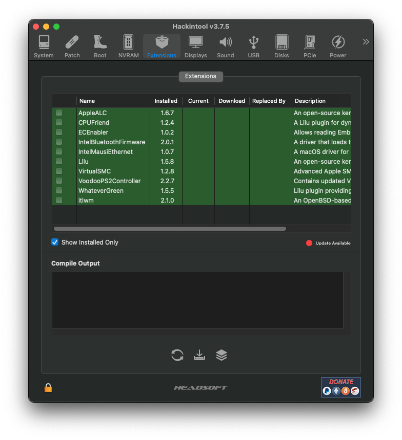
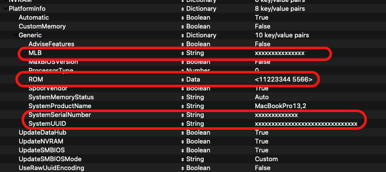

<h1> DELL Latitude E5570 Hackintosh Opencore</h1>

  

<h2>Spec</h2>

<i>This is spec of my laptop. This EFI can be used for all of DELL Latitude E5570</i>

<ul>
  <li>i5-6440HQ (Can be used for other Skylake CPU)</li>
  <li>HD530 (if you have AMD Radeon R7 M370, it will be disabled, it doesn't work with macOS)</li>
  <li>Wireless: Intel AC 8260</li>
   
</ul>

<h2>What doesn't work?</h2>
<ul>
  <li>Airdrop</li>
  <li>Trackpad using >= 3 fingers</li>
  <li><s>VGA port (Apple had stopped using VGA ports.)</s> Fixed by <a href="https://github.com/quynkk1">@quynkk1</a></li>
  <li>SmoothScroll (Can be fixed by <a href="https://mos.caldis.me/">MOS</a> or <a href="https://www.smoothscroll.net/mac/">SmoothScroll</a>)</li>
</ul>

<h2>Kexts</h2>

  

<h2>How to use?</h2>
<i>As of EFI version 1.1.0 I only create EFI for macOS Monterey.</i>
<h3>Download EFI</h3>
<ul>
  <li>
    
  </li>
  <li>
    
  </li>
</ul>

<h3>Edit your EFI</h3>

  

<ul>
  <li>
    Use <a href="https://github.com/corpnewt/GenSMBIOS">GenSMBIOS</a> to generate SMBIOS.
  </li>
  <li>
    Use <a href="https://github.com/corpnewt/ProperTree">ProperTree</a> to add SMBIOS information to config.plist file.
  </li>
</ul>

<h3>Create boot</h3>
<ul>
  <li>Format your USB to <code>fat32</code>.</li>
  <li>Copy folder <code>EFI</code> to your USB.</li>
  <li>Create folder <code>com.apple.recovery.boot</code> in your USB.</li>
  <li>Download <code>macOS Recovery</code> - follow <a href="https://dortania.github.io/OpenCore-Install-Guide/installer-guide/">here</a>.</li>
  <li>Copy 2 files <code>BaseSystem.dmg</code> & <code>BaseSystem.chunklist</code> to folder <code>com.apple.recovery.boot</code>.</li>
</ul>

<h3>Installing</h3>
<ul>
  <li>Follow <a href="https://dortania.github.io/OpenCore-Install-Guide/installation/installation-process.html">here.</a></li>
</ul>
